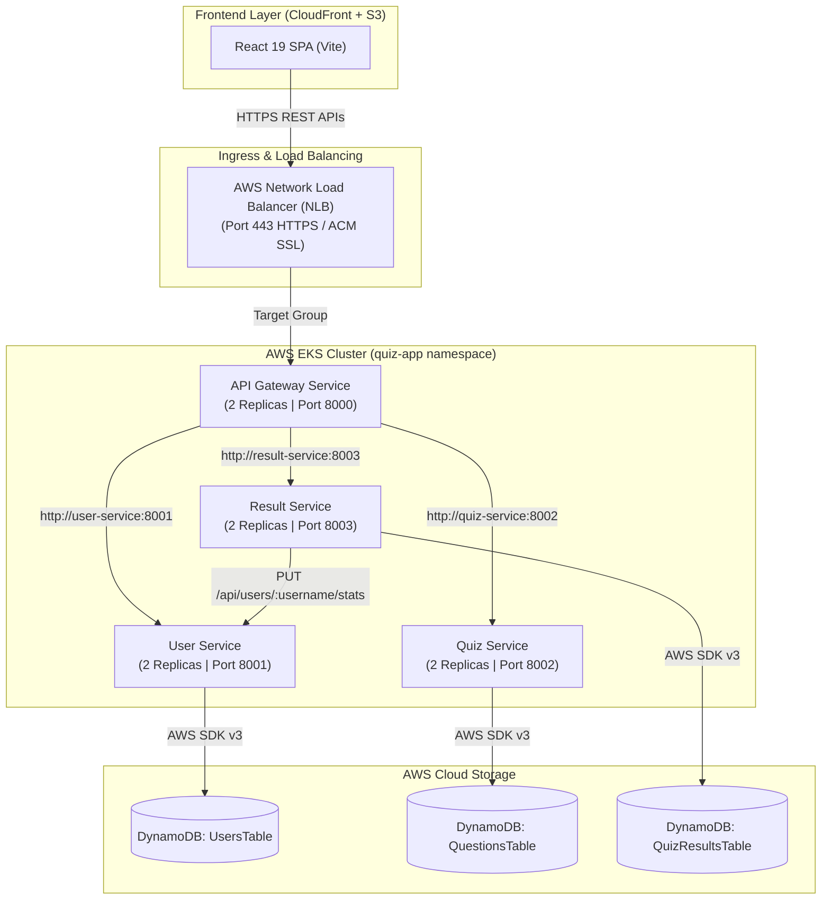

# DevOps & Cloud Engineering Quiz Application

A high-performance, responsive microservices-based quiz application built for DevOps and Cloud Engineers. The platform features real-time 5-question skill assessments, live timer-based testing, instant server-side grading, answer auditing with detailed technical explanations, case-insensitive unique handle registration, and global performance ranking leaderboards.

---

## 🏗️ System Architecture Overview



---

## 🌐 Production Domains & Infrastructure

- **Frontend Application**: Hosted on AWS S3 & distributed globally via AWS CloudFront CDN.
- **Production API Base URL**: `https://api.quiz.mzsk.fun/api`
- **Gateway Health Endpoint**: `https://api.quiz.mzsk.fun/health`
- **Kubernetes Platform**: AWS Elastic Kubernetes Service (EKS) in `ap-south-1`.

---

## ☸️ Kubernetes Infrastructure & Manifests (`k8s/`)

The application is deployed on **AWS EKS** inside the `quiz-app` namespace with zero-downtime rolling updates and automated health checks.

| Manifest File | Resource Type | Description & Features |
| :--- | :--- | :--- |
| **[`k8s/00-namespace.yaml`](file:///e:/DevOps-Quiz-Project/k8s/00-namespace.yaml)** | `Namespace` | Defines the isolated `quiz-app` namespace for all resources. |
| **`k8s/secrets.yaml`** | `Secret` | Contains AWS credentials (`quiz-app-secrets`). *(Ignored via `.gitignore`)* |
| **[`k8s/api-gateway-service.yaml`](file:///e:/DevOps-Quiz-Project/k8s/api-gateway-service.yaml)** | `Deployment` & `Service` | 2 Replicas, AWS NLB (Internet-facing), ACM SSL Certificate termination on port 443, rolling update strategy (`maxSurge: 1`). |
| **[`k8s/user-service.yaml`](file:///e:/DevOps-Quiz-Project/k8s/user-service.yaml)** | `Deployment` & `Service` | 2 Replicas, ClusterIP service (`:8001`), `/health` liveness probe, and `/ready` DynamoDB connectivity probe. |
| **[`k8s/quiz-service.yaml`](file:///e:/DevOps-Quiz-Project/k8s/quiz-service.yaml)** | `Deployment` & `Service` | 2 Replicas, ClusterIP service (`:8002`), `/health` and `/ready` health probes. |
| **[`k8s/result-service.yaml`](file:///e:/DevOps-Quiz-Project/k8s/result-service.yaml)** | `Deployment` & `Service` | 2 Replicas, ClusterIP service (`:8003`), `/health` and `/ready` health probes. |

---

## 🔄 CI/CD Automation Workflows (`.github/workflows/`)

All code changes trigger automated GitHub Actions CI/CD workflows:

1. **Frontend Deployment (`frontend-deploy.yml`)**:
   - Triggers on pushes to `frontend/**`.
   - Builds production bundle (`vite build`).
   - Syncs static assets to AWS S3 bucket (`aws s3 sync --delete`).
   - Invalidates AWS CloudFront CDN cache (`aws cloudfront create-invalidation --paths "/*"`).

2. **Microservices Automated EKS Deployments**:
   - [`api-gateway-service.yml`](file:///e:/DevOps-Quiz-Project/.github/workflows/api-gateway-service.yml), [`user-service.yml`](file:///e:/DevOps-Quiz-Project/.github/workflows/user-service.yml), [`quiz-service.yml`](file:///e:/DevOps-Quiz-Project/.github/workflows/quiz-service.yml), [`result-service.yml`](file:///e:/DevOps-Quiz-Project/.github/workflows/result-service.yml).
   - Builds Docker container images and pushes tagged versions to **AWS ECR**.
   - Authenticates to AWS EKS (`aws eks update-kubeconfig`).
   - Applies Kubernetes manifests (`kubectl apply -f k8s/`).
   - Triggers rolling restarts (`kubectl rollout restart`) and waits for deployment rollout status verification (`kubectl rollout status`).

---

## 🔍 Frontend Application Details

The frontend is a modern Single Page Application (SPA) built using **React 19**, **Vite**, **Lucide React** icons, and **Canvas Confetti**.

### Key Components

| Component / File | Purpose & Responsibilities | Backend Integration Point |
| :--- | :--- | :--- |
| **`App.jsx`** | Central state orchestrator for landing screen, quiz screen, results screen, and global error banners. | Coordinates API calls through client services. |
| **`Navbar.jsx`** | Header navigation with branding and direct modal triggers for rankings and user profile history. | Triggers Leaderboard fetch. |
| **`UsernameModal.jsx`** | Onboarding modal where engineers select an avatar (`⚡`, `🚀`, `🥷`, `🐳`, `🏗️`, `🛡️`) and handle. | `POST /api/users` (User Service) |
| **`QuizCard.jsx`** | Assessment container with 25-second question timers, option selections, and progress tracking. | `GET /api/quizzes/random` (Quiz Service) |
| **`ResultsView.jsx`** | Displays accuracy score %, time elapsed, rank standing, celebratory confetti (≥80%), and answer review. | `POST /api/results` (Result Service) |
| **`LeaderboardModal.jsx`**| Displays the global Hall of Fame table sorted by highest score and fastest completion time. | `GET /api/leaderboard` (Result Service) |
| **`UserHistoryModal.jsx`**| Displays historical assessment attempt logs, accuracy %, total evaluations taken, and highest score earned. | `GET /api/users/:username` & `GET /api/results/user/:username` |

---

## ⚙️ Microservices Specification

### 1. 🛡️ API Gateway Service (`backend/api-gateway-service`)
- **Role**: Central entry point for all frontend client traffic.
- **Target Port**: `8000` (Local) / `https://api.quiz.mzsk.fun` (AWS NLB)
- **Path Proxies**:
  - `/api/users` → User Service (`:8001`)
  - `/api/quizzes` → Quiz Service (`:8002`)
  - `/api/results` & `/api/leaderboard` → Result Service (`:8003`)

### 2. 👤 User Service (`backend/user-service`)
- **Role**: Manages user profiles, handles, and user session identity.
- **Target Port**: `8001`
- **Responsibilities**:
  - Register new engineers with selected avatar and handle.
  - Enforce case-insensitive unique username validation (`HTTP 409 Conflict` on duplicate handles).
  - Update user stats (`total_quizzes`, `highest_score`, `last_active_at`) upon quiz completion via `PUT /api/users/:username/stats`.

### 3. 🧩 Quiz Service (`backend/quiz-service`)
- **Role**: Manages question pool, quiz sessions, and server-side evaluation.
- **Target Port**: `8002`
- **Responsibilities**:
  - Serve randomized 5-question evaluation sets filtered by categories (Docker, Kubernetes, CI/CD, IaC, Networking).
  - Hide correct answer keys during question delivery for client-side security.
  - Perform server-side grading of submitted answer keys (`POST /api/quizzes/submit`).

### 4. 🏆 Result & Leaderboard Service (`backend/result-service`)
- **Role**: Records assessment submissions, calculates global rankings, and serves leaderboards.
- **Target Port**: `8003`
- **Responsibilities**:
  - Record score, completion time, category stats, and attempt timestamp into `QuizResultsTable`.
  - Trigger `user-service` to persist user evaluation counts and highest scores.
  - Calculate global leaderboard rank based on primary sort (**Score DESC**) and secondary tie-breaker (**Time Elapsed ASC**).

---

## 🗄️ AWS DynamoDB Database Design

AWS DynamoDB serves as the serverless, highly available NoSQL database layer.

```
   ┌────────────────────────────────────────────────────────────────────────┐
   │                          AWS DYNAMODB TABLES                           │
   ├───────────────────────┬───────────────────────┬────────────────────────┤
   │      UsersTable       │    QuestionsTable     │    QuizResultsTable    │
   ├───────────────────────┼───────────────────────┼────────────────────────┤
   │ PK: user_id (S)       │ PK: question_id (S)   │ PK: result_id (S)      │
   │ GSI: UsernameIndex    │ GSI: CategoryIndex    │ GSI: UsernameResults   │
   └───────────────────────┴───────────────────────┴────────────────────────┘
```

---

## 📡 REST API Specifications

### User Service (`/api/users`)
- `POST /api/users` - Create user profile (`409 Conflict` if handle exists).
- `GET /api/users/:username` - Get engineer profile statistics.
- `PUT /api/users/:username/stats` - Update `total_quizzes` and `highest_score`.

### Quiz Service (`/api/quizzes`)
- `GET /api/quizzes/random?count=5` - Fetch 5 randomized questions (answers hidden).
- `POST /api/quizzes/submit` - Grade quiz submission server-side and return full breakdown.
- `POST /api/quizzes/seed` - Seed question pool.

### Result & Leaderboard Service (`/api/results` & `/api/leaderboard`)
- `POST /api/results` - Save attempt result, update user stats, and compute rank.
- `GET /api/leaderboard` - Retrieve global leaderboard rankings.
- `GET /api/results/user/:username` - Retrieve past quiz attempts for an engineer.

---

## 📁 Repository Structure

```
DevOps-Quiz-Project/
├── README.md                      # Complete System & Infrastructure Documentation
├── .gitignore                     # Git Exclusion Rules (includes k8s/secrets.yaml)
├── DevOps_Quiz_API.postman_collection.json # API Testing Collection
├── .github/workflows/             # GitHub Actions CI/CD Workflows
│   ├── frontend-deploy.yml        # Build, S3 Sync & CloudFront Invalidation
│   ├── api-gateway-service.yml    # ECR Build + EKS Rollout
│   ├── user-service.yml           # ECR Build + EKS Rollout
│   ├── quiz-service.yml           # ECR Build + EKS Rollout
│   └── result-service.yml         # ECR Build + EKS Rollout
├── k8s/                           # Kubernetes Deployment Manifests
│   ├── 00-namespace.yaml          # quiz-app Namespace definition
│   ├── secrets.yaml               # Kubernetes Secret (AWS credentials)
│   ├── api-gateway-service.yaml   # AWS NLB + Ingress Gateway Deployment
│   ├── user-service.yaml          # User Service Deployment & ClusterIP
│   ├── quiz-service.yaml          # Quiz Service Deployment & ClusterIP
│   └── result-service.yaml        # Result Service Deployment & ClusterIP
├── frontend/                      # React 19 + Vite Web Client
│   ├── src/                       # Components, Services, & App Layout
│   └── public/                    # Static Assets & SVG Favicon
└── backend/                       # Microservices Directory
    ├── api-gateway-service/       # Express Proxy Gateway (Port 8000)
    ├── user-service/              # User Service (Port 8001)
    ├── quiz-service/              # Quiz Service (Port 8002)
    └── result-service/            # Result Service (Port 8003)
```

---

## 🚀 Quick Start & Local Development

### 1. Start All Microservices
Run from the root directory:
```bash
npm run dev:backend
```
Launches all microservices concurrently:
- 🛡️ **API Gateway**: `http://localhost:8000/api`
- 👤 **User Service**: `http://localhost:8001`
- 🧩 **Quiz Service**: `http://localhost:8002`
- 🏆 **Result Service**: `http://localhost:8003`

### 2. Start Frontend Web Client
In a separate terminal:
```bash
npm run dev:frontend
```
Access the web interface at `http://localhost:5173`.

---

## 📮 API Testing with Postman

A pre-configured Postman Collection (v2.1.0) is included in the project root:
- [`DevOps_Quiz_API.postman_collection.json`](file:///e:/DevOps-Quiz-Project/DevOps_Quiz_API.postman_collection.json)

### How to Import & Test:
1. Open **Postman**.
2. Click **Import** -> Select `DevOps_Quiz_API.postman_collection.json`.
3. Test endpoints:
   - `0. Gateway Health`: Check status of Gateway & Services.
   - `1. User Service`: Profile registration (`POST /api/users`) & lookup (`GET /api/users/:username`).
   - `2. Quiz Service`: Fetch questions (`GET /api/quizzes/random`) & submit keys (`POST /api/quizzes/submit`).
   - `3. Result Service`: Save results (`POST /api/results`) & fetch leaderboard (`GET /api/leaderboard`).
