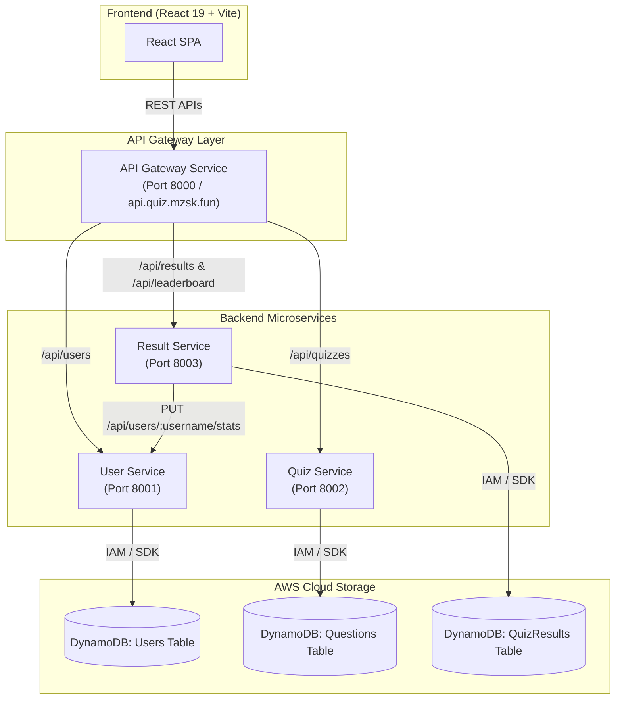

# DevOps & Cloud Engineering Quiz Application

A high-performance, responsive microservices-based quiz application built for DevOps and Cloud Engineers. The platform features real-time 5-question skill assessments, live timer-based testing, instant server-side grading, answer auditing with detailed technical explanations, case-insensitive unique handle registration, and global performance ranking leaderboards.

---

## 🏗️ System Architecture Overview



---

## 🌐 Production Domain & Deployment

- **Production API Base URL**: `https://api.quiz.mzsk.fun/api`
- **Gateway Health Endpoint**: `https://api.quiz.mzsk.fun/health`
- **Route Namespace**: All API routes use `/api/...` (without `/v1` prefix).

---

## 🔍 Frontend Application Analysis

The frontend is a modern Single Page Application (SPA) built using **React 19**, **Vite**, **Lucide React** icons, and **Canvas Confetti**.

### Key Frontend Views & Components

| Component / File | Purpose & Responsibilities | Backend Integration Point |
| :--- | :--- | :--- |
| **`App.jsx`** | Central state orchestrator for landing screen, quiz screen, and results screen. | Coordinates API calls through client services. |
| **`Navbar.jsx`** | Clean header navigation with direct modal trigger for global rankings and user profile history. | Triggers Leaderboard fetch. |
| **`UsernameModal.jsx`** | Onboarding modal where engineers select an avatar (`⚡`, `🚀`, `🥷`, `🐳`, `🏗️`, `🛡️`) and handle. Enforces unique handle selection. | `POST /api/users` (User Service) |
| **`QuizCard.jsx`** | Main assessment container. Runs 25-second per-question timers, option selections, progress bar, and user answer tracking. | `GET /api/quizzes/random` (Quiz Service) |
| **`ResultsView.jsx`** | Displays accuracy score %, time elapsed, rank standing, celebratory confetti (≥80%), shareable snippet, and itemized answer review. | `POST /api/results` (Result Service) |
| **`LeaderboardModal.jsx`**| Displays the global Hall of Fame table sorted by highest score and fastest completion time. | `GET /api/leaderboard` (Result Service) |
| **`UserHistoryModal.jsx`**| Displays historical assessment attempt logs, accuracy %, total evaluations taken, and highest score earned by engineer. | `GET /api/users/:username` & `GET /api/results/user/:username` |

---

## ⚙️ Microservices Specification

The microservices architecture under `/backend` includes four services:

### 1. 🛡️ API Gateway Service (`backend/api-gateway-service`)
- **Role**: Central entry point for all frontend client traffic.
- **Target Port**: `8000` (Local) / `https://api.quiz.mzsk.fun` (AWS)
- **Path Proxies**:
  - `/api/users` → User Service (`:8001`)
  - `/api/quizzes` → Quiz Service (`:8002`)
  - `/api/results` & `/api/leaderboard` → Result Service (`:8003`)

### 2. 👤 User Service (`backend/user-service`)
- **Role**: Manages user profiles, handles, and user session identity.
- **Target Port**: `8001`
- **Responsibilities**:
  - Register new engineers with selected avatar and handle.
  - Enforce case-insensitive unique username validation (`HTTP 409 Conflict` on duplicate handles).
  - Update user stats (`total_quizzes`, `highest_score`, `last_active_at`) upon quiz completion via `PUT /api/users/:username/stats`.

### 3. 🧩 Quiz Service (`backend/quiz-service`)
- **Role**: Manages question pool, quiz sessions, and server-side evaluation.
- **Target Port**: `8002`
- **Responsibilities**:
  - Serve randomized 5-question evaluation sets filtered by categories (Docker, Kubernetes, CI/CD, IaC, Networking).
  - Hide correct answer keys during question delivery for client-side security.
  - Perform server-side grading of submitted answer keys (`POST /api/quizzes/submit`).

### 4. 🏆 Result & Leaderboard Service (`backend/result-service`)
- **Role**: Records assessment submissions, calculates global rankings, and serves leaderboards.
- **Target Port**: `8003`
- **Responsibilities**:
  - Record score, completion time, category stats, and attempt timestamp into `QuizResultsTable`.
  - Trigger `user-service` to persist user evaluation counts and highest scores.
  - Calculate global leaderboard rank based on primary sort (**Score DESC**) and secondary tie-breaker (**Time Elapsed ASC**).

---

## 🗄️ AWS DynamoDB Database Design

AWS DynamoDB serves as the serverless, highly available NoSQL database layer.

```
   ┌────────────────────────────────────────────────────────────────────────┐
   │                          AWS DYNAMODB TABLES                           │
   ├───────────────────────┬───────────────────────┬────────────────────────┤
   │      UsersTable       │    QuestionsTable     │    QuizResultsTable    │
   ├───────────────────────┼───────────────────────┼────────────────────────┤
   │ PK: user_id (S)       │ PK: question_id (S)   │ PK: result_id (S)      │
   │ GSI: UsernameIndex    │ GSI: CategoryIndex    │ GSI: UsernameResults   │
   └───────────────────────┴───────────────────────┴────────────────────────┘
```

### Table 1: `UsersTable`
Stores engineer profile details and lifetime performance metrics.

- **Partition Key (PK)**: `user_id` (String, UUID v4)
- **Global Secondary Index (GSI)**: `UsernameIndex` (`username` String)

```json
{
  "user_id": "usr_9b1deb4d-3b7d-4bad-9bdd-2b0d7b3dcb6d",
  "username": "AlexCloudDev",
  "avatar": "⚡",
  "created_at": "2026-08-07T14:32:00Z",
  "last_active_at": "2026-08-10T10:15:11Z",
  "total_quizzes": 12,
  "highest_score": 5
}
```

### Table 2: `QuestionsTable`
Stores the DevOps skill evaluation question pool.

- **Partition Key (PK)**: `question_id` (String, e.g., `q_docker_001`)

```json
{
  "question_id": "q_k8s_002",
  "category": "Kubernetes",
  "question": "In Kubernetes, which controller object ensures that a specified number of pod replicas are running across nodes at any given time?",
  "options": [
    "ReplicaSet",
    "IngressController",
    "DaemonSet",
    "ConfigMap"
  ],
  "correct_option": 0,
  "explanation": "A ReplicaSet ensures that a specified number of pod replicas are running at any given time."
}
```

### Table 3: `QuizResultsTable`
Stores attempt outcomes and powers global ranking leaderboards.

- **Partition Key (PK)**: `result_id` (String, UUID v4)

```json
{
  "result_id": "res_8f3a1290-e2b4-4c12-a890-7d312bc89123",
  "username": "AlexCloudDev",
  "avatar": "⚡",
  "score": 5,
  "total": 5,
  "timeTaken": 34,
  "percentage": 100,
  "date": "2026-08-10",
  "created_at": "2026-08-10T10:15:10Z",
  "status": "COMPLETED"
}
```

---

## 📡 REST API Specifications

### User Service (`/api/users`)
- `POST /api/users` - Create user profile (`409 Conflict` if handle exists).
- `GET /api/users/:username` - Get engineer profile statistics.
- `PUT /api/users/:username/stats` - Update `total_quizzes` and `highest_score`.

### Quiz Service (`/api/quizzes`)
- `GET /api/quizzes/random?count=5` - Fetch 5 randomized questions (answers hidden).
- `POST /api/quizzes/submit` - Grade quiz submission server-side and return full breakdown.
- `POST /api/quizzes/seed` - Seed question pool.

### Result & Leaderboard Service (`/api/results` & `/api/leaderboard`)
- `POST /api/results` - Save attempt result, update user stats, and compute rank.
- `GET /api/leaderboard` - Retrieve global leaderboard rankings.
- `GET /api/results/user/:username` - Retrieve past quiz attempts for an engineer.

---

## 📁 Repository Structure

```
DevOps-Quiz-Project/
├── README.md                      # Architecture & Microservices Documentation
├── .gitignore                     # Git Exclusion Rules
├── DevOps_Quiz_API.postman_collection.json # API Testing Collection
├── frontend/                      # React 19 + Vite Web Application
│   ├── .env                       # Frontend Environment Variables
│   ├── .env.example               # Frontend Environment Example
│   ├── src/
│   │   ├── components/            # UI Components (Navbar, QuizCard, ResultsView, etc.)
│   │   ├── services/              # API Client Service (`api.js`)
│   │   ├── utils/                 # Leaderboard utilities
│   │   ├── App.jsx                # Layout & view routing
│   │   └── main.jsx               # React entry point
│   └── vite.config.js
└── backend/                       # Microservices Directory
    ├── api-gateway-service/       # Reverse proxy API Gateway (Port 8000)
    ├── user-service/              # User registration & stats persistence (Port 8001)
    ├── quiz-service/              # Question pool & server grading (Port 8002)
    └── result-service/            # Results processing & leaderboard (Port 8003)
```

---

## 🚀 Quick Start & Local Development

### 1. Start All Microservices
Run from the root directory:
```bash
npm run dev:backend
```
Launches all microservices concurrently:
- 🛡️ **API Gateway**: `http://localhost:8000/api`
- 👤 **User Service**: `http://localhost:8001`
- 🧩 **Quiz Service**: `http://localhost:8002`
- 🏆 **Result Service**: `http://localhost:8003`

### 2. Start Frontend Web Client
In a separate terminal:
```bash
npm run dev:frontend
```
Access the web interface at `http://localhost:5173`.

---

## 📮 API Testing with Postman

A pre-configured Postman Collection (v2.1.0) is included in the project root:
- [`DevOps_Quiz_API.postman_collection.json`](file:///e:/DevOps-Quiz-Project/DevOps_Quiz_API.postman_collection.json)

### How to Import & Test:
1. Open **Postman**.
2. Click **Import** -> Select `DevOps_Quiz_API.postman_collection.json`.
3. Test endpoints:
   - `0. Gateway Health`: Check status of Gateway & Services.
   - `1. User Service`: Profile registration (`POST /api/users`) & lookup (`GET /api/users/:username`).
   - `2. Quiz Service`: Fetch questions (`GET /api/quizzes/random`) & submit keys (`POST /api/quizzes/submit`).
   - `3. Result Service`: Save results (`POST /api/results`) & fetch leaderboard (`GET /api/leaderboard`).
